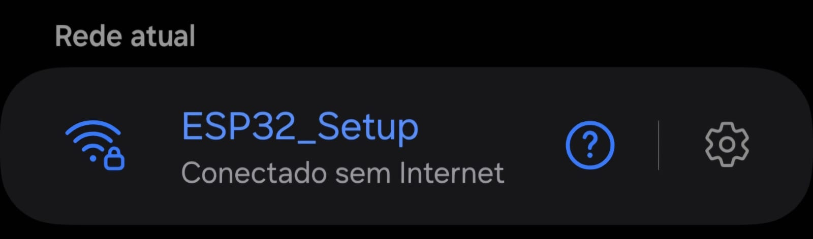
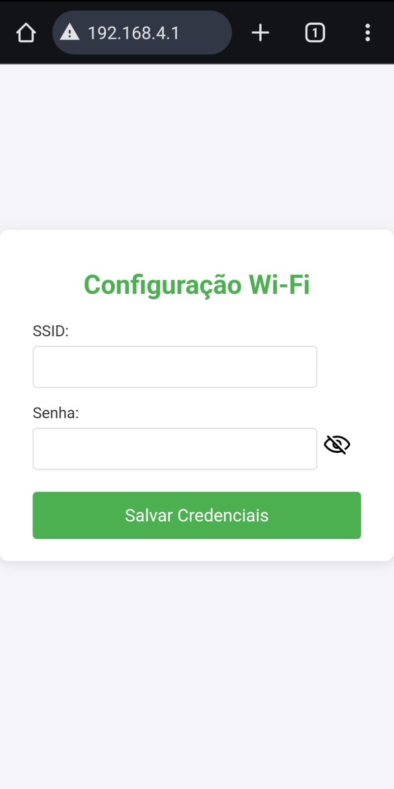
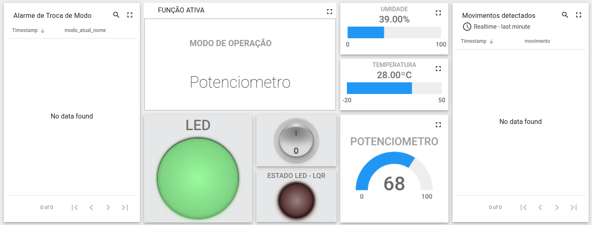

# Sistema de Controle de Iluminação Predial

Este projeto visa desenvolver um sistema de controle de iluminação predial utilizando ESP32, MQTT e integração com a plataforma ThingsBoard. O sistema oferece controle automatizado da iluminação de ambientes, com diferentes modos de operação para atender às necessidades dos usuários e às condições do ambiente, maximizando a eficiência energética e o conforto.

## Sumário
- [Descrição do Problema](#descrição-do-problema)
- [Funcionalidades](#funcionalidades)
- [Modos de Funcionamento](#modos-de-funcionamento)
- [Tecnologias Utilizadas](#tecnologias-utilizadas)
- [Componentes Utilizados](#componentes-utilizados)
- [Comunicação e Integração](#comunicação-e-integração)
- [Configuração do Ambiente ESP32](#configuração-do-ambiente-esp32)
- [Configuração do WiFi](#configuração-do-wifi)
- [Dashboard](#dashboard)
- [Contribuidores](#contribuidores)
- [Licença](#licença)


## Descrição do Problema

A gestão de iluminação em prédios envolve fatores como a presença de pessoas, níveis de luminosidade externa e necessidades específicas de controle. Este projeto propõe automatizar o controle de iluminação, oferecendo modos ajustáveis que otimizam o consumo de energia e proporcionam conforto aos usuários.

## Funcionalidades

O sistema é composto por quatro módulos ESP32, cada um com funcionalidades distintas e componentes eletrônicos específicos:

1. **esp-pedro**: Exibe o modo de operação atual e permite a troca de modos através de um botão, sinalizando a mudança com um buzzer.
   - Display OLED
   - Botão interno
   - LED interno
   - Buzzer

2. **esp-gabriel**: Lê e envia os valores do potenciômetro quando o modo correspondente está selecionado, além de monitorar continuamente o LDR e enviar os dados ao ThingsBoard.
   - Sensor LDR
   - Potenciômetro

3. **esp-doug**: Controla a iluminação de acordo com o modo de operação atual e exibe os dados na interface do ThingsBoard. Também permite a configuração simplificada das credenciais de Wi-Fi.
   - LED interno
   - LED externo (simula a lâmpada)

4. **esp-arthur**: Mede a temperatura e umidade e detecta movimentos quando o sistema está em modo presença, caso não esteja, dorme e acorda periodicamente para medir a temperatura.
   - LED interno
   - Sensor de temperatura e umidade
   - Sensor de movimento

## Modos de Funcionamento

O sistema opera em diferentes modos, selecionados e enviados por um ESP32 principal. Os demais módulos ajustam seu comportamento conforme o modo atual:

1. **Modo Sensor de Presença**: Controla a iluminação com base na detecção de movimento no ambiente.
2. **Modo Potenciômetro**: Permite ajuste manual da intensidade da luz através de um potenciômetro.
3. **Modo Controle via ThingsBoard**: A iluminação pode ser controlada remotamente através da interface gráfica no ThingsBoard.

## Tecnologias Utilizadas

- **Linguagem C**: Desenvolvimento do firmware dos ESP32.
- **ESP-IDF**: Framework de desenvolvimento da Espressif para ESP32.
- **MQTT**: Protocolo de comunicação entre os ESP32 e o ThingsBoard.
- **ThingsBoard**: Plataforma IoT para monitoramento e controle remoto.

## Componentes Utilizados

- **ESP32**: Microcontroladores para controle e comunicação.
- **Potenciômetro**: Controle manual da intensidade da luz.
- **Sensor de Movimento**: Detecta a presença de pessoas para acionar automaticamente a iluminação.
- **Sensor LDR**: Monitora a luminosidade ambiente para ajuste automático da luz.
- **Sensor de Temperatura e Umidade**: Mede as condições ambientais para possíveis ajustes no sistema.
- **LEDs**: Simulam a iluminação controlada.
- **Display OLED**: Mostra o modo de operação atual.
- **Botão Interno**: Para troca de modos de operação.
- **Buzzer**: Indica alterações no modo de operação.

## Comunicação e Integração

- A comunicação entre as ESP32 e o ThingsBoard é feita utilizando o protocolo MQTT, que permite o envio de dados de telemetria e o recebimento de comandos para ajuste dos modos de operação.

## Configuração do Ambiente ESP32

Este guia fornece instruções para configurar o ambiente de desenvolvimento para ESP32, clonando o repositório ESP-IDF, instalando as dependências e executando o build do projeto.

### 1. Criar o Diretório da ESP
```
mkdir ~/esp
```

### 2. Clonar o Repositório ESP-IDF
```
git clone --recursive https://github.com/espressif/esp-idf.git ~/esp/esp-idf
```

### 3. Instalar Dependências
```
cd ~/esp/esp-idf
./install.sh
```

### 4. Ativar o Ambiente da ESP
```
. ~/esp/esp-idf/export.sh
```

### 6. Configuração das variáveis de ambiente
#### Entre no diretório de cada esp e execute o comando do menuconfig:
```
idf.py menuconfig
```

#### Configurações possíveis:

##### Todas as eps

###### OPCIONAL - Em caso de erro de tamanho de memória flash:
1. Serial flasher config
2. Flash size(...)
3. Defina como 4 MB

##### esp-doug

###### OBRIGATÓRIO - Aumento do tamanho do header das requisições HTTP :
1. Component config
2. HTTP Server
3. Max HTTP Request Header Length
4. Defina como 1024
5. OBS.: Necessário para configuração do WiFi por servidor Web.

###### OPCIONAL - SSID da rede para configuração do WiFi pelo servidor Web:
1. Configuração do Wifi
2. SSID do WiFi de Configuração
3. O padrão é `ESP_Setup` 

###### OPCIONAL - Senha da rede para configuração do WiFi pelo servidor Web:
1. Configuração do Wifi
2. Senha do WiFi de Configuração
3. O padrão é `12345678` 

###### OPCIONAL - Número máximo de tentativas de conexão que a ESP vai fazer às redes WiFi:
1. Configuração do Wifi
2. Número máximo de tentativas de conexão
3. O padrão é 5

##### esp-arthur

###### OBRIGATÓRIO - SSID da rede a qual a ESP vai se conectar:
1. Configuração do Wifi
2. WiFi SSID

###### OBRIGATÓRIO - Senha da rede a qual a ESP vai se conectar:
1. Configuração do Wifi
2. Senha do Wifi

###### OPCIONAL - Número máximo de tentativas de conexão que a ESP vai fazer às redes WiFi:
1. Configuração do Wifi
2. Número máximo de tentativas de conexão
3. O padrão é 5


##### esp-pedro
* OBS.: A configuração do SSID e da senha da rede a qual a ESP vai se conectar é feita no arquivo `esp-pedro/main/src/global.h` com as macros `SSID` e `PASSWORD `.


##### esp-gabriel
* OBS.: A configuração do SSID e da senha da rede a qual a ESP vai se conectar é feita no arquivo `esp-gabriel/main/src/global.h` com as macros `SSID` e `PASSWORD `.

### 7. Fazer build do Projeto
#### Entre no diretório de cada esp e execute o comando de build:
```
idf.py build
```

### 8. Fazer flash do Código na Placa
#### Com cada placa ESP32 conectada ao seu computador, envie o código para a placa:
```
idf.py flash
```

#### Ou, especificando a porta:
```
idf.py -p PORT flash
```

## Configuração do WiFi

### Configuração do Wi-Fi pelo Modo AP (esp-doug)

Quando o ESP32 não consegue se conectar a uma rede conhecida, ele entra no modo Access Point (AP). Nesse modo, ele cria uma rede Wi-Fi (o SSID e senha dessa rede são definidos como variáveis de ambiente, conforme citado anteriormente), permitindo configurar novas credenciais.

#### Passos para Configuração:

1. **Conectar ao AP:** No seu dispositivo, conecte-se à rede `ESP32_Setup` criada pela ESP32 com a senha `12345678`.

<p align="center"></p>

2. **Acessar a Interface Web:** Abra o navegador e vá para `192.168.4.1` para acessar a página de configuração.
3. **Inserir Credenciais:** Preencha os campos de SSID e senha da rede Wi-Fi desejada e clique em "Salvar Credenciais".

<p align="center"></p>

4. **Confirmar Conexão:**
   - Se bem-sucedido, uma mensagem aparecerá informando que o dispositivo irá reiniciar e tentar conectar à nova rede.
   - Se a conexão falhar, você será notificado e poderá tentar novamente.

Após salvar as configurações, o ESP32 tentará se conectar à rede configurada. Se falhar, após algumas tentativas, ele retornará ao modo AP para nova configuração.

## Dashboard

### [Dashboard - ThingsBoard](http://164.41.98.25:443/dashboards/89e035e0-6556-11ef-b837-251c88993eff)

<p align="center"></p>

* **Alarme de Troca de Modo**: Mostra o histórico dos modos;
* **Movimentos detectados**: Mostra o histórico de movimentos detectados;
* **Função ativa**: Mostra o modo atual do sitema;
* **LED**: Representa o LED que simula a lâmpada;
* **Switch**: Ativa e desativa o LED quando está no modo Interface;
* **Estado LED-LDR**: Representa o sensor LDR que garante o funcinamento do LED;
* **Potenciômetro**: Mostra o nível do potenciômetro;
* **Temperatura**: Mostra a temperatura atual;
* **Umidade**: Mostra a umidade atual;

## Contribuidores

|  |  |  |  |
|:---:|:---:|:---:|:---:|
| [Arthur Grandão de Mello](https://github.com/arthurgrandao) | [Douglas Alves dos Santos](https://github.com/dougAlvs) | [Gabriel Campello Marques](https://github.com/G16C) | [Pedro Sampaio Dias](https://github.com/PedroSampaioDias) |


## Licença

Este projeto está licenciado sob a MIT License - veja o arquivo [LICENSE](LICENSE) para mais detalhes.
